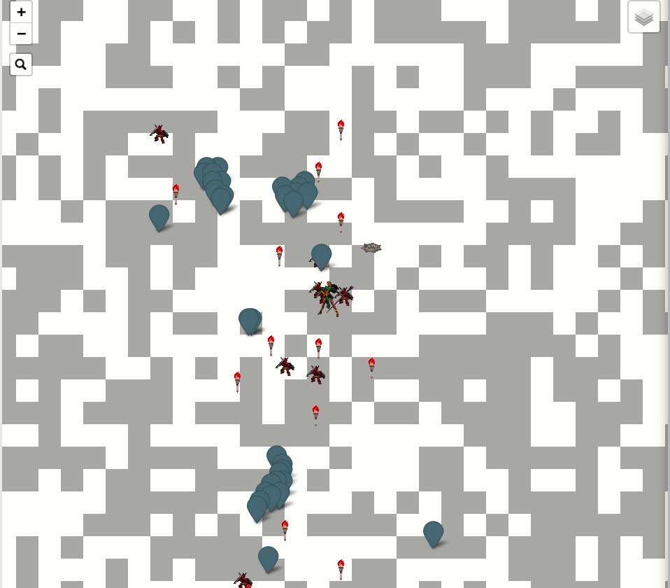
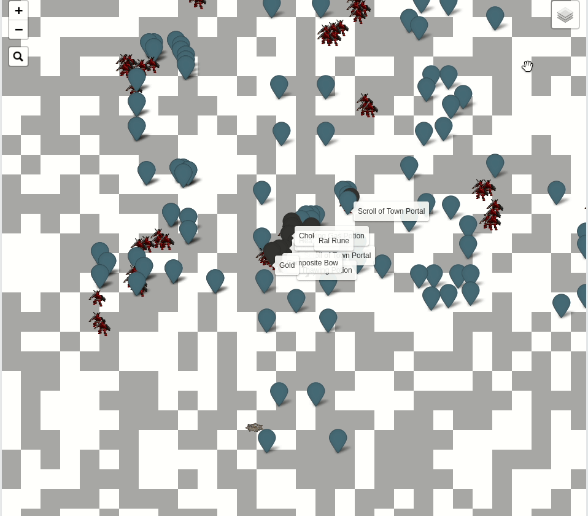
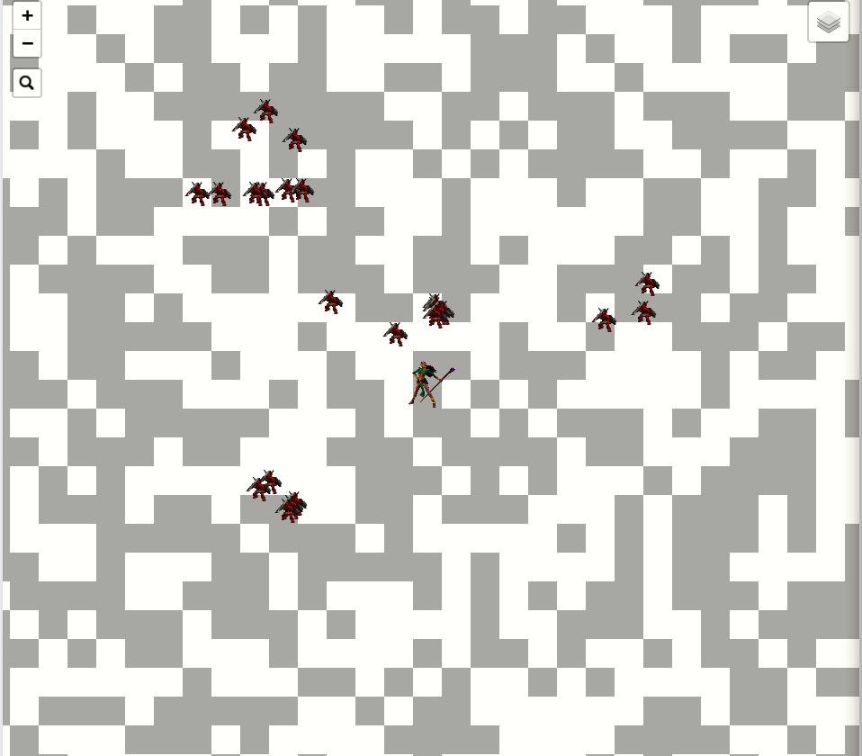
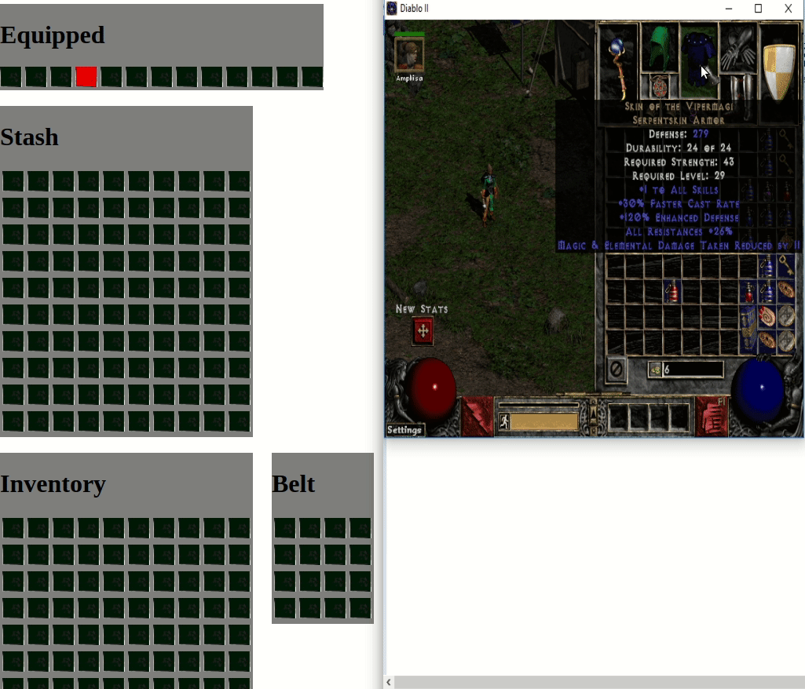
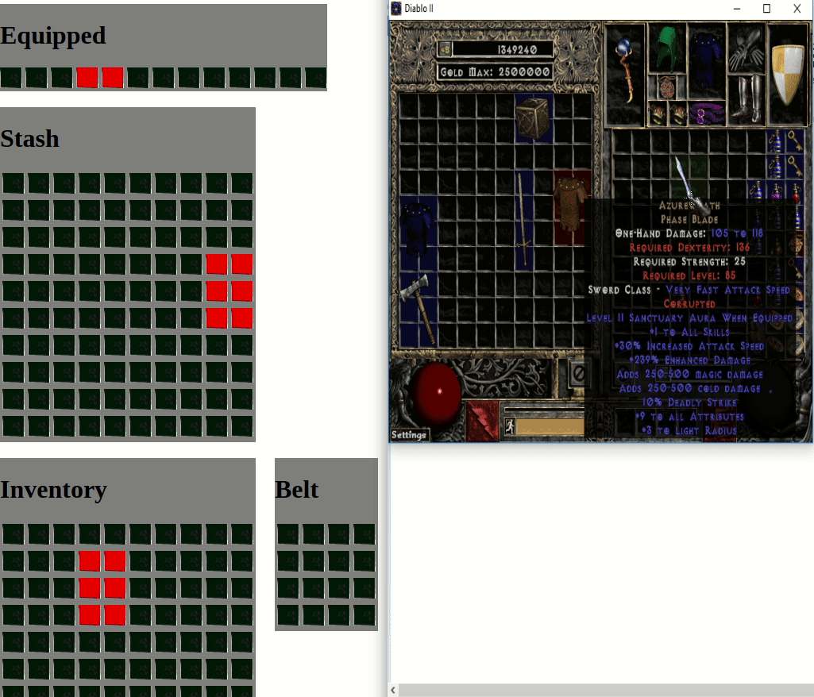

# diablo2-live-viewer

Display packets and information about a current diablo2 session

**Map**

  

**Inventory**

 

Uses
* [leaflet](https://leafletjs.com/) to display maps
* [jquery datatables](https://datatables.net/) to display packet tables
* [lit-element](https://lit-element.polymer-project.org/) to create light weight web components (no framework !)
* [webpack](https://webpack.js.org/) for bundling
* [create-lit-app](https://github.com/thepassle/create-lit-app) was used as a template to create the initial structure of the project

## Installation

`npm install`

## Usage

First start https://github.com/louis030195/diablo2-protocol 's sniffer or bot then :

`npm start`
